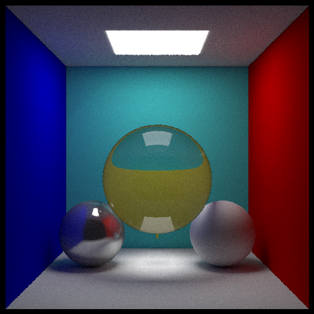

# A-simple-cpp-path-tracer

 

这是一个简单的路径追踪器，使用C++语言实现了漫反射、镜面反射和折射的材质效果。

我在网上发现了EzRT项目，认为跟着这个项目的路线去学习补充知识十分不错。这个项目就是我学习EzRT Part1的最后成果，为了真正达到学习目的只顺着EzRT作者添加功能的思路，功能的实现全部由我自己完成。

到最后这个项目还没有bug没有修改成功，或者说是有一个地方我没有搞懂（我写在了Note.md中），但结果还可以。图形学代码的结果只要看起来没问题就没问题（确信

## Reference
[EzRT/Part1](https://github.com/AKGWSB/EzRT/tree/main/part%201%20--%20Basic%20Raytracing%20with%20C%2B%2B) 

[GAMES101](https://sites.cs.ucsb.edu/~lingqi/teaching/games101.html) 

[Ray Tracing in one weekend](https://raytracing.github.io/books/RayTracingInOneWeekend.html)

$$
\frac{1}{\pi}
$$
