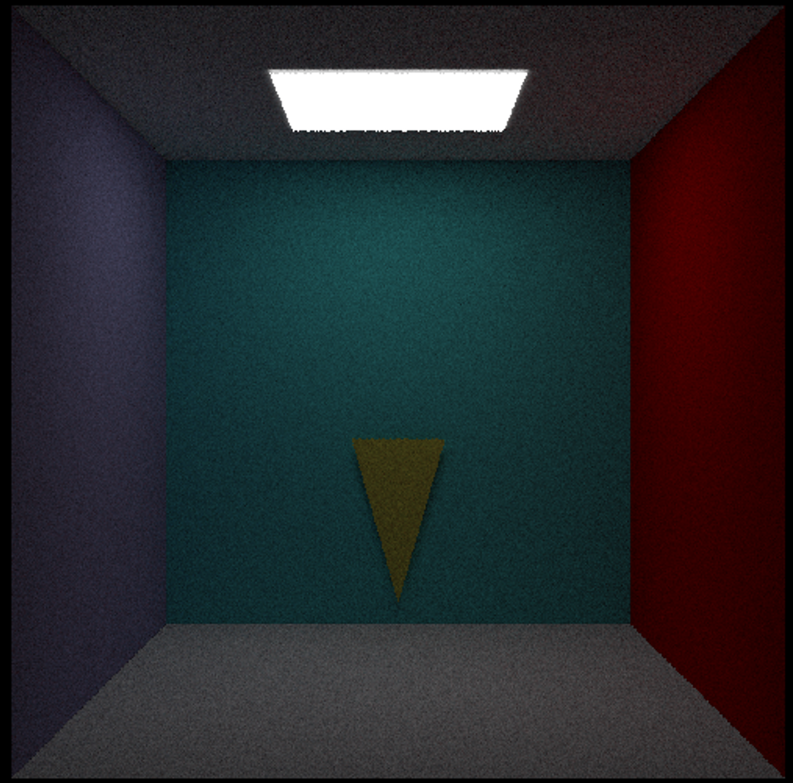
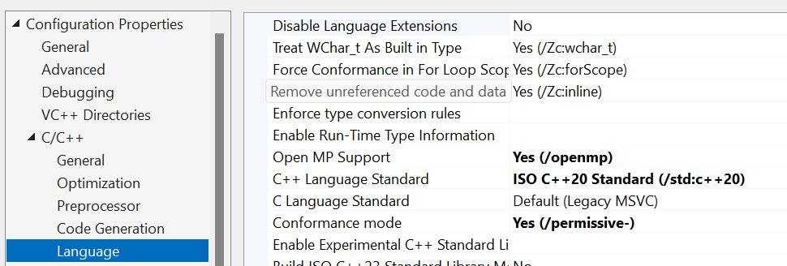
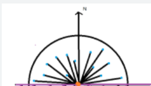
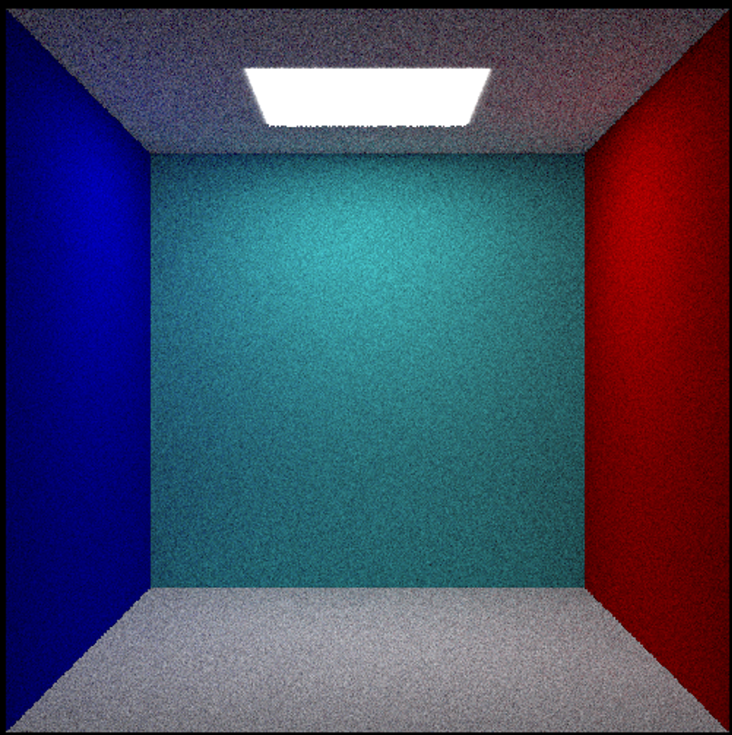
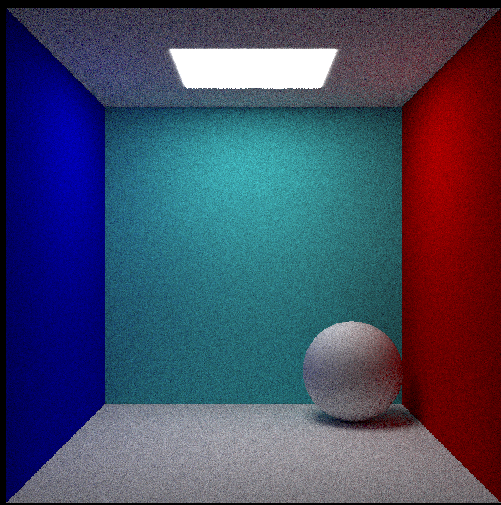
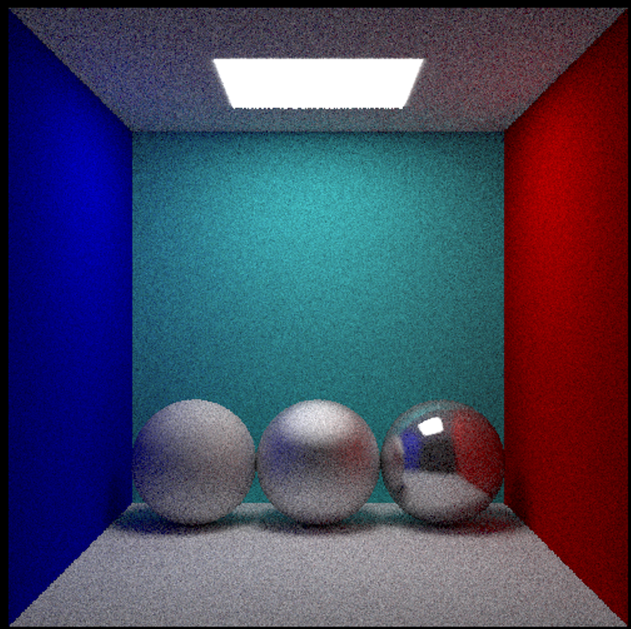
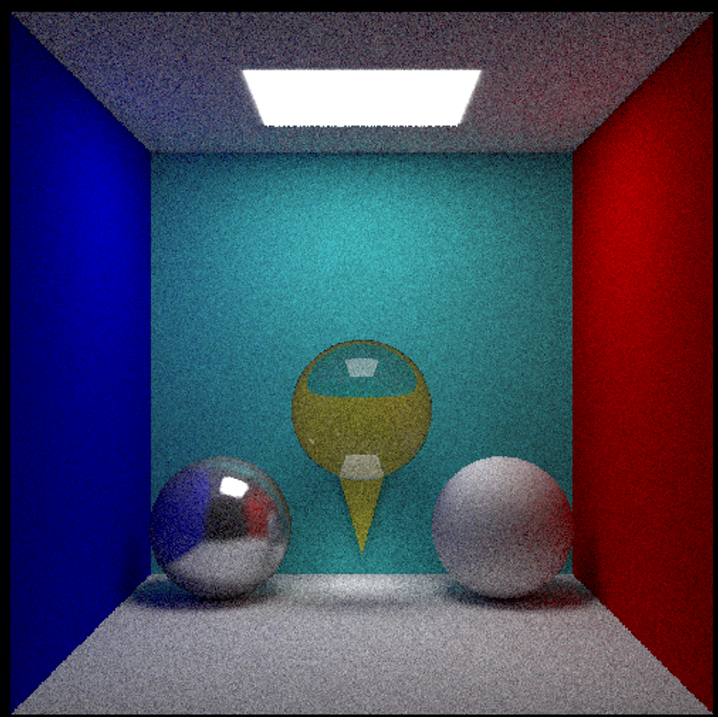

# Bug

我想把目前的bug，或者说我很难搞懂的点放在这里

在单项路径追踪中，如果不采用直接对光源采样的方式，则伪代码为

```cpp
shade(p, ωo)
{
	Manually specify a probability P_RR
	Randomly select ksi in a uniform dist. in [0, 1]
	If (ksi > P_RR) return 0.0
	
	
	Randomly choose one direction wi~pdf
	Trace a ray r(p, wi)
	If ray r hit the light
		return Li * fr * cosine / pdf(wi) / P_RR
	Else if ray r hit an object at q
		return shade(q, -wi) * fr * cosine / pdf(wi) / P_RR
}
```

我的实现为

```cpp
//路径追踪函数，返回该光线的颜色
glm::vec3 PathTracing(std::vector<Shape*>& shapes, Ray ray, int depth)
{

	if (depth >= MAX_DEPTH) return glm::vec3(0.0f);
	HitResult res = intersect(shapes, ray);

	if (res.isHit)
	{
		//如果交点是光源，则直接返回光源颜色
		if (res.material->isEmissive) return res.material->color;
		//如果交点不是光源，则随机确定一个方向采样
		//俄罗斯轮盘赌让光线以一定概率停下
		double P = random_double();
		if (P > RR) return glm::vec3(0.0f);

		double R(random_double());
		glm::vec3 blendingColor(1.0f);
		//随机选取一个方向
		Ray sampling_ray = res.material->scattered(res.hitPoint, res.normal, blendingColor, ray.direction);

		
		HitResult sampling_res = intersect(shapes, sampling_ray);

		float cosine(glm::dot(res.normal, sampling_ray.direction));

		//这里的blendingColor可以认为是BRDF
		if (sampling_res.isHit)
		{
			return PathTracing(shapes, sampling_ray, depth + 1) * blendingColor * cosine/ pdf_hemi / (float)RR;
		}
	}

	return glm::vec3(0.0f);
}
```

漫反射的scattered函数除了返回了一个采样的方向外，将BRDF设置为了材质本身的颜色 * (0.5 / PI)，因为我查到的漫反射表面的BRDF一般都是ρ / PI，其中ρ大于0小于1代表了吸收率。并且ρ打了之后效果也不是很好。

求图片颜色时我直接

```cpp
			for (int k = 0; k < SSP; k++) // SSP 是每个像素的采样数
			{
				//多次采样，投射光线计算颜色值，
				color += PathTracing(shapes, ray, 0);
			}
			color /= static_cast<float>(SSP);
```

这样得到的图片颜色很暗。我不知道是不是因为没有对光源直接采样的原因。下图是512 * 512分辨率，SSP = 512的结果



但如果漫反射的scattered函数将将BRDF设置为了材质本身的颜色，不乘以ρ / PI；PathTracing函数中，递归时不除以pdf

```
return PathTracing(shapes, sampling_ray, depth + 1) * blendingColor * cosine / (float)RR;
```

求图片颜色时

```cpp
			for (int k = 0; k < SSP; k++) // SSP 是每个像素的采样数
			{
				//多次采样，投射光线计算颜色值，
				color += PathTracing(shapes, ray, 0) / pdf_hemi;
			}
			color /= static_cast<float>(SSP);
```

这样得到的结果反而相当不错。但超出了我的理解范围，我是真搞不懂。下面的代码现已这个结果不错的为准。

# Environment Configuration

## glm

数学运算库我们使用经典的glm，在learnOpenGL中我们使用就是glm库。

GLM 是 OpenGL Mathematics 的缩写，是一个只包含头文件的库，这意味着我们只需包含适当的头文件就可以了，无需链接和编译。

https://glm.g-truc.net/0.9.8/index.html

将头文件的根目录复制到包含文件夹中，然后开始工作。

我们所需的 GLM 大部分功能都可以在 3 个头文件中找到，我们将把它们包含在下面的文件中：

```cpp
#include <glm/glm.hpp>
#include <glm/gtc/matrix_transform.hpp>
#include <glm/gtc/type_ptr.hpp>
```

## svpng

轻量级的图像库，只需要把它放在工程目录下，然后再 `#include "svpng.inc"` 即可调用它。

https://github.com/miloyip/svpng

在该库的github上，有用于测试的代码，但该代码中涉及的函数`fopen`不够安全已经弃用，替代是使用`fopen_s`

```cpp
void test_rgb(void) {
    unsigned char rgb[256 * 256 * 3], *p = rgb;
    unsigned x, y;
    FILE *fp;
    fopen_s(&fp, "rgb.png", "wb");
    for (y = 0; y < 256; y++)
        for (x = 0; x < 256; x++) {
            *p++ = (unsigned char)x;    /* R */
            *p++ = (unsigned char)y;    /* G */
            *p++ = 128;                 /* B */
        }
    svpng(fp, 256, 256, rgb, 0);
    fclose(fp);
}
```

## multi-threaded

毕竟是在CPU上运行的程序，不使用多线程将会极大地增加运行的时间。

**OpenMP**（Open Multi-Processing）是一种应用程序编程接口（API），支持在C、C++和Fortran等多个平台上进行共享内存多处理器编程

https://www.openmp.org/resources/refguides/

**Visual Studio 2019** 已经内置支持 **OpenMP**，但我们仍然需要对项目进行一些配置。

- **C/C++** > **语言** > **支持 OpenMP**：设置为 **是 (/openmp)**。



**/O2**（最大化速度）：这个选项设置了一系列特定的优化选项，以在大多数情况下生成最快的代码。


# Camera and Ray Casting

我们需要确定一个摄像机位置，是观察场景的虚拟视点

```cpp
const glm::vec3 CAMERA(0.0f, 0.0f, 4.0f);
```

我们还需要知道“标准化设备坐标”（Normalized Device Coordinates，NDC）。在计算机图形学中，NDC是一种抽象的坐标系统，用于统一不同分辨率和纵横比的显示设备。在NDC中，任何需要被渲染的点都被转换到这个[-1, 1]×[-1, 1]的坐标空间内，其中(0,0)代表视图的中心，(-1, -1)代表左下角，(1, 1)代表右上角。我们需要摄像机投射光线穿过这个空间中的每个像素，之后跟踪这条光线计算最终图像的颜色和亮度。可以简单将其理解为屏幕，因为最终我们显示的内容就是这个空间的内容。（但我们没有进行视口变换）

因为NDC的[-1, 1]×[-1, 1]已经固定，我们只需要设定其Z轴的值。

```cpp
const float SCREEN_Z = 1.1;
```

NDC（Normalized Device Coordinates）虽然提供了一个统一的坐标系统，允许在一个标准化的空间内操作，但最终渲染出来的图像需要在具体的显示设备上展示，比如电脑屏幕、手机屏或打印输出。这些显示设备都有自己的分辨率，即能够显示的像素数。因此，在渲染图像时，需要指定一个具体的输出分辨率

```cpp
const int HEIGHT = 512, WIDTH = 512;
```

下面进行光线投射方向的计算

```cpp
for (int i = 0; i < HEIGHT; i++)
{
	for (int j = 0; j < WIDTH; j++)
	{
		double x = 2.0 * j / double(WIDTH) - 1.0;//将列坐标j转换到[-1, 1]的范围。
		double y = 2.0 * (HEIGHT - i) / double(HEIGHT) - 1.0;//在屏幕的坐标原点通常在左上角，y轴向下，但世界坐标系原点在中心，且y轴向上为正。因此，需要这样的转换来翻转y坐标

		//计算光线方向
		glm::vec3 pixel_poi(x, y, SCREEN_Z);
		glm::vec3 ray_direction = glm::normalize(pixel_poi - CAMERA);
		Ray ray(CAMERA, ray_direction);
	}
}
```

图像输出，得到的image.png应该是全黑色

```cpp
	double* image = new double[HEIGHT * WIDTH * 3];
	memset(image, 0.0, sizeof(double) * WIDTH * HEIGHT * 3);	
	for (int i = 0; i < HEIGHT; i++)
	{
		for (int j = 0; j < WIDTH; j++)
		{
			//从世界坐标到图像坐标的转化
			double x = 2.0 * j / double(WIDTH) - 1.0;
			double y = 2.0 * (HEIGHT - i) / double(HEIGHT) - 1.0;

			//计算光线方向
			glm::vec3 pixel_poi(x, y, SCREEN_Z);
			glm::vec3 ray_direction = glm::normalize(pixel_poi - CAMERA);
			Ray ray(CAMERA, ray_direction);
            
            glm::vec3 color(0.0f);

			// 计算索引位置
			int idx = (i * WIDTH + j) * 3;
			image[idx + 0] = color.x;
			image[idx + 1] = color.y;
			image[idx + 2] = color.z;
		}
	}

	unsigned char* c_image = new unsigned char[WIDTH * HEIGHT * 3];// 图像buffer
	unsigned char* c_p = c_image;
	double* S = image;
	for (int i = 0; i < HEIGHT; i++)
	{
		for (int j = 0; j < WIDTH; j++)
		{
			*c_p++ = (unsigned char)glm::clamp(pow(*S++, 1.0f / 2.2f) * 255, 0.0, 255.0);  // R 通道
			*c_p++ = (unsigned char)glm::clamp(pow(*S++, 1.0f / 2.2f) * 255, 0.0, 255.0);  // G 通道
			*c_p++ = (unsigned char)glm::clamp(pow(*S++, 1.0f / 2.2f) * 255, 0.0, 255.0);  // B 通道
		}
	}
	FILE* fp;
	fopen_s(&fp, "image.png", "wb");

	svpng(fp, WIDTH, HEIGHT, c_image, 0);
	fclose(fp);
```

图像输出的格式仿照了svpng的示例，注意我们使用了伽马校正`pow(*S++, 1.0f / 2.2f)`

> 这里可能有人想一步到位，直接将double image换成unsigned char* image，但这是不可取的，从double转换到unsigned char会损失精度，得到的图像相当不正常。

# Random

这里写一下我们之后会用到的多个随机数函数，用到了random库（自带的

```cpp
inline double random_double()
{
	static std::uniform_real_distribution<double> distribution(0.0, 1.0);
	static std::mt19937 generator;
	return distribution(generator);
}

inline double random_double(double min, double max)
{
	return (max - min) * random_double() + min;
}
```

剔除法生成在单位球内的单位向量，简单来讲如果生成的向量不在一个单位球内，我们就舍弃，直到符合条件

```cpp
inline glm::vec3 random_in_unit_sphere()
{
	while (true)
	{
		glm::vec3 p(random_double(-1, 1), random_double(-1, 1), random_double(-1, 1));
		if (glm::dot(p, p) < 1) return glm::normalize(p);
	}
}
```

normal是一个点的法线，我们要生成这个法线的法向半球内的向量（漫反射）



> 图来源自：https://blog.csdn.net/qq_39300235/article/details/102460405

```cpp
inline glm::vec3 random_in_hemisphere(const glm::vec3& normal)
{
	glm::vec3 p = random_in_unit_sphere();
	if (glm::dot(p, normal) > 0.0) return p;
	else return -p;
}
```

生成Lamberian反射（理想散射）的向量

```cpp
inline glm::vec3 Lambertian_vector(glm::vec3 normal)
{
	return glm::normalize(normal + random_in_unit_sphere());
}
```

# Ray Intersection With Triangle Mesh

光线的定义

```cpp
struct Ray
{
	glm::vec3 origin = glm::vec3(0.0f);
	glm::vec3 direction = glm::vec3(0.0f);
};
```

下面我们需要实现材质，不同的材质与光线的相互作用不同

```cpp
class Material
{
public:

	Material() {}

    //是否自发光，也就是是否是光源
	bool isEmissive = false;
	glm::vec3 color = glm::vec3(0.0f);
	//简言之，给定一条入射光线，计算该入射光线在交点的这种材质下的反射光线
	virtual Ray scattered(glm::vec3 hitPoint, glm::vec3 normal, glm::vec3& blendingColor, glm::vec3 in_direct) const = 0;
};
```

Ray scattered是关键的函数，对于这种材质的某一个点hitpoint，这个点的法向量是normal，光线的入射方向是in_direct，而返回值是一个反射光线的方向。也就是光线与材质作用后的结果。其中blendingColor可以理解为BRDF项，我们使用引用的方式作为了函数参数，也就是说这是此函数的另一个返回值。

我们实现理想散射，Lambertian反射材质。我们要实现的是单向路径追踪，漫反射后光线散射到四面八方，但我们只跟踪随机的一个方向。

```cpp
//漫反射材质
class Lambertian : public Material
{
public:
	Lambertian(glm::vec3 Color)
	{
		this->color = Color;
	}

	Ray scattered(glm::vec3 hitPoint, glm::vec3 normal, glm::vec3& blendingColor, glm::vec3 in_direct) const override
	{
		glm::vec3 sampling_dir(Lambertian_vector(normal));

		blendingColor = this->color;

		return Ray(hitPoint, sampling_dir);
	}
};
```

光线与物体相交，其交点信息很重要，我们需要一个专门的数据结构存储

```cpp
//光线与物体交点
struct HitResult
{
	bool isHit = false;
	float distance = 0.0f;
	glm::vec3 hitPoint = glm::vec3(0.0f);
	glm::vec3 normal = glm::vec3(0.0f);
	std::shared_ptr<Material> material;
};
```

现在的很多复杂模型都是由很多个三角形组成的， 计算光线与三角形相交十分重要。

我们先定义Shape基类

```cpp
class Shape
{
public:
	Shape() {}
	virtual HitResult intersect(Ray ray) const = 0;
};
```

intersect函数很好理解，给定一条光线判断是否与该形状有交点。

下面给出Triangle类

```cpp
class Triangle : public Shape
{
public:
	Triangle() {}
	Triangle(glm::vec3 P0, glm::vec3 P1, glm::vec3 P2, std::shared_ptr<Material> material)
		: p0(P0), p1(P1), p2(P2)
	{
		this->material = material;
		this->normal = glm::normalize(glm::cross(p1 - p0, p2 - p0));
	}
	
	glm::vec3 p0, p1, p2;
	glm::vec3 normal;
	std::shared_ptr<Material> material;
};
```

成员变量是三个顶点，三角形的法线和材质。

对于光线与三角形相交，我们使用Moller Trumbore算法

```cpp
	HitResult intersect(Ray ray) const override
	{
		HitResult res;

		glm::vec3 normal = glm::dot(ray.direction, material.normal) > 0 ? -material.normal : material.normal;
		// 如果视线和三角形平行
		if (fabs(glm::dot(normal, ray.direction)) < 0.00001f) return res;

		glm::vec3 E1 = p1 - p0, E2 = p2 - p0, S = ray.origin - p0;

		// 利用光线方向和E2的叉乘结果S1，以及S和E1的叉乘结果S2
		glm::vec3 S1 = glm::cross(ray.direction, E2), S2 = glm::cross(S, E1);

		float divisor = glm::dot(S1, E1);
		// 当除数接近于0时，光线与三角形平行，无交点
		if ((fabs(glm::dot(normal, ray.direction)) < 0.00001f) return res;
		float invDivisor = 1.0f / divisor;

		float b1 = glm::dot(S1, S) * invDivisor;
		float b2 = glm::dot(S2, ray.direction) * invDivisor;
		float t = glm::dot(S2, E2) * invDivisor;

		// 检查贝塞尔坐标是否在三角形内部，并确保t大于一个阈值以避免自交
		if (b1 < 0.0f || b1 > 1.0f || b2 < 0.0f || (b1 + b2) > 1.0f || t < 0.005f) return res;

		res.isHit = true;
		res.distance = t;
		res.hitPoint = ray.origin + t * ray.direction;
		res.material = material;
		res.material.normal = normal;
		return res;
	}
```

> 这里需要注意要在适当的时候使用绝对值，否则就会导致严重错误。如if (fabs(glm::dot(normal, ray.direction)) < 0.00001f)和if ((fabs(glm::dot(normal, ray.direction)) < 0.00001f)，它们俩作用是类似的。

# Scene 

我们添加一些用到的常量

```cpp
const double PI = std::numbers::pi;
//半球采样的pdf
const float pdf_hemi = 1.0f / (2.0f * PI);
//每个像素的采样次数
const int SSP = 512;
//俄罗斯轮盘赌概率
const double RR = 0.8f;
//最大递归深度
const int MAX_DEPTH = 100;

```

一个场景是多个shape的结合，我们用vector存储。

```cpp
std::vector<Shape*> shapes;
```

当一根光线投射进场景时，我们不会记录一根光线跟所有shapes的交点，而是只记录离摄像机最近的交点。

```cpp
HitResult intersect(std::vector<Shape*>& shapes, Ray ray)
{
	HitResult res, r;
	res.distance = std::numeric_limits<float>::infinity();

	for (auto& shape : shapes)
	{
		r = shape->intersect(ray);
		if (r.isHit && r.distance < res.distance) res = r;
	}
	return res;
}
```

之后我们写光线追踪函数，虽然我们使用了俄罗斯轮盘赌去防止光线持续递归，但我们还是得设定一个最大深度做一个保障。

```cpp
//路径追踪函数，返回该光线的颜色
glm::vec3 PathTracing(std::vector<Shape*>& shapes, Ray ray, int depth)
{

	if (depth >= MAX_DEPTH) return glm::vec3(0.0f);
	HitResult res = intersect(shapes, ray);

	if (res.isHit)
	{
		//如果交点是光源，则直接返回光源颜色
		if (res.material->isEmissive) return res.material->color;
		//如果交点不是光源，则随机确定一个方向采样
		//俄罗斯轮盘赌让光线以一定概率停下
		double P = random_double();
		if (P > RR) return glm::vec3(0.0f);

		double R(random_double());
		glm::vec3 blendingColor(1.0f);
		//随机采样一个方向的光线
		Ray sampling_ray = res.material->scattered(res.hitPoint, res.normal, blendingColor, ray.direction);

		HitResult sampling_res = intersect(shapes, sampling_ray);

		float cosine(glm::dot(res.normal, sampling_ray.direction));


		if (sampling_res.isHit)
		{	//递归计算光线的颜色值
			return PathTracing(shapes, sampling_ray, depth + 1) * blendingColor * cosine / (float)RR;
		}
	}

	return glm::vec3(0.0f);
}
```

这里我们并没有分开求直接光照和间接光照，因为我发现，在我的代码中两者是可以写到一块的，结果也相同。（当然如果我是错的请帮忙指出来）

向场景中添加物体

```cpp
// 发光物
Triangle l1 = Triangle(glm::vec3(0.4, 0.99, 0.4), glm::vec3(-0.4, 0.99, -0.4), glm::vec3(-0.4, 0.99, 0.4), std::make_shared<Lambertian>(WHITE));
Triangle l2 = Triangle(glm::vec3(0.4, 0.99, 0.4), glm::vec3(0.4, 0.99, -0.4), glm::vec3(-0.4, 0.99, -0.4), std::make_shared<Lambertian>(WHITE));
l1.material->isEmissive = true;
l2.material->isEmissive = true;
shapes.push_back(&l1);
shapes.push_back(&l2);

// 背景盒子
// bottom
shapes.push_back(new Triangle(glm::vec3(1, -1, 1), glm::vec3(-1, -1, -1), glm::vec3(-1, -1, 1), std::make_shared<Lambertian>(WHITE)));
shapes.push_back(new Triangle(glm::vec3(1, -1, 1), glm::vec3(1, -1, -1), glm::vec3(-1, -1, -1), std::make_shared<Lambertian>(WHITE)));
// top
shapes.push_back(new Triangle(glm::vec3(1, 1, 1), glm::vec3(-1, 1, 1), glm::vec3(-1, 1, -1), std::make_shared<Lambertian>(WHITE)));
shapes.push_back(new Triangle(glm::vec3(1, 1, 1), glm::vec3(-1, 1, -1), glm::vec3(1, 1, -1), std::make_shared<Lambertian>(WHITE)));
// back
shapes.push_back(new Triangle(glm::vec3(1, -1, -1), glm::vec3(-1, 1, -1), glm::vec3(-1, -1, -1), std::make_shared<Lambertian>(CYAN)));
shapes.push_back(new Triangle(glm::vec3(1, -1, -1), glm::vec3(1, 1, -1), glm::vec3(-1, 1, -1), std::make_shared<Lambertian>(CYAN)));
// left
shapes.push_back(new Triangle(glm::vec3(-1, -1, -1), glm::vec3(-1, 1, 1), glm::vec3(-1, -1, 1), std::make_shared<Lambertian>(BLUE)));
shapes.push_back(new Triangle(glm::vec3(-1, -1, -1), glm::vec3(-1, 1, -1), glm::vec3(-1, 1, 1), std::make_shared<Lambertian>(BLUE)));
// right
shapes.push_back(new Triangle(glm::vec3(1, 1, 1), glm::vec3(1, -1, -1), glm::vec3(1, -1, 1), std::make_shared<Lambertian>(RED)));
shapes.push_back(new Triangle(glm::vec3(1, -1, -1), glm::vec3(1, 1, 1), glm::vec3(1, 1, -1), std::make_shared<Lambertian>(RED)));
```

在计算生成图片的循环中

```cpp
//计算光线方向
glm::vec3 pixel_poi(x, y, SCREEN_Z);
glm::vec3 ray_direction = glm::normalize(pixel_poi - CAMERA);
Ray ray(CAMERA, ray_direction);

glm::vec3 color(0.0f);
for (int k = 0; k < SSP; k++) // SSP 是每个像素的采样数
{
	//多次采样，投射光线计算颜色值，
	color += PathTracing(shapes, ray, 0) / pdf_hemi;
}

color /= static_cast<float>(SSP);
```



# Sphere

球类的光线与物体求交的方法我还真不知道具体叫什么算法，主要是将光源与球心连接起来，之后寻找这根线与光线的几何关系。

```cpp
//球类
class Sphere : public Shape {
public:
	Sphere() {}
	Sphere(glm::vec3 Center, float Radius, std::shared_ptr<Material> material)
		: center(Center), radius(Radius)
	{
		this->material = material;
	}
	//计算光线是否与该物体相交，并返回交点
	HitResult intersect(Ray ray) const override
	{
		HitResult res;
		glm::vec3 L = center - ray.origin;
		float t_center = glm::dot(L, ray.direction);
		if (t_center < 0) return res;

		float d2(glm::dot(L, L) - t_center * t_center);
		float r2(radius * radius);

		if (d2 > r2) return res;

		float t_hc(sqrt(r2 - d2));
		float t0(t_center - t_hc);
		float t1(t_center + t_hc);

		if (t0 > t1) std::swap(t0, t1);

		const float epsilon = 0.0001f;
		if (t0 < epsilon)
		{
			t0 = t1;
			if (t1 < epsilon) return res;
		}

		res.isHit = true;
		res.distance = t0;
		res.hitPoint = ray.origin + t0 * ray.direction;
		res.material = material;
		glm::vec3 normal = glm::normalize(res.hitPoint - center);
		res.normal = glm::dot(ray.direction, normal) > 0 ? -normal : normal; // 根据射线方向调整法线方向

		return res;
	}

	glm::vec3 center;
	float radius;
	std::shared_ptr<Material> material;
};
```

向场景中添加一个球

```cpp
Sphere s1(glm::vec3(0.6, -0.7, -0.5), 0.3, std::make_shared<Lambertian>(WHITE));
shapes.push_back(&s1);
```



阴影明显是软阴影，并且球身体的阴影效果也还行。

# Reflect

下面我们实现能够进行镜面反射的材质。

```cpp
class Reflect : public Material
{
public:
	float reflectRate = 0.0f;//反射率
	float roughtness = 1.0f;//粗糙率

	Reflect(glm::vec3 Color)
	{
		this->color = Color;
	}

};
```

反射率就是光有多少会被此材料镜面反射，其余会进行漫反射。

而粗糙率会对反射方向提供一个随机扰动。这两个成员变量让这个材质更加灵活，呈现更多效果。

```cpp
Ray scattered(glm::vec3 hitPoint, glm::vec3 normal, glm::vec3& blendingColor, glm::vec3 in_direct) const override
{

	double R(random_double());
	glm::vec3 sampling_dir;
    //根据反射率判断反射方式
	if (R < this->reflectRate)//镜面反射
	{
		glm::vec3 random_dir(random_in_hemisphere(normal));
		glm::vec3 reflect_dir(glm::reflect(in_direct, normal));
		sampling_dir = glm::normalize(glm::mix(reflect_dir, random_dir, this->roughtness));//使用插值的方法添加一个随机扰动
	}
	else//漫反射
	{
		sampling_dir = Lambertian_vector(normal);
		blendingColor = this->color;
	}

	return Ray(hitPoint, sampling_dir);
}
```

修改场景

```cpp
auto white_reflect1(std::make_shared<Reflect>(WHITE));
auto white_reflect2(std::make_shared<Reflect>(WHITE));
auto white_reflect3(std::make_shared<Reflect>(WHITE));
white_reflect1->reflectRate = 0.8f;
white_reflect2->reflectRate = 0.6f;
white_reflect3->reflectRate = 0.5f;

white_reflect1->roughtness = 0.1f;
white_reflect2->roughtness = 0.5f;
white_reflect3->roughtness = 0.8f;

Sphere s1(glm::vec3(0.6, -0.7, -0.5), 0.3, white_reflect1);
Sphere s2(glm::vec3(0.0, -0.7, -0.5), 0.3, white_reflect2);
Sphere s3(glm::vec3(-0.6, -0.7, -0.5), 0.3, white_reflect3);

shapes.push_back(&s1);
shapes.push_back(&s2);
shapes.push_back(&s3);
```



# Reflact

我们会用到的关键函数：

`glm::refract `函数需要三个参数，入射方向，法线，以及入射材料和出射材料的折射率比值。返回值就是出射方向。

那我们根据Snell's law写出第一版代码

```cpp
class Refract : public Material
{
public:

	Refract(float IR) : ir(IR) {}


	Ray scattered(glm::vec3 hitPoint, glm::vec3 normal, glm::vec3& blendingColor, glm::vec3 in_direct) const override
	{
		float refraction_ratio = glm::dot(normal, in_direct) < 0 ? 1.0f / ir : ir;//通过判断光线是从空气射入材质还是从材质射出空气调整折射率比值。
		glm::vec3 unit_direct(glm::normalize(in_direct));
		glm::vec3 refracted_dir(glm::refract(unit_direct, normal, refraction_ratio));

		return Ray(hitPoint, refracted_dir);
	}

	float ir;//该材质的折射率
};
```

根据Snell' s Law
$$
sinθ^′=\frac{η}{η′}⋅sinθ
$$
首先θ‘是未知的，所以一旦
$$
sinθ^′=\frac{η}{η′}⋅sinθ  >1
$$
肯定就不能折射，这不符合物理定律，此时会发生全反射。

据此，我们应该添加是否能进行折射的判断，写出第二版代码

```cpp
Ray scattered(glm::vec3 hitPoint, glm::vec3 normal, glm::vec3& blendingColor, glm::vec3 in_direct) const override
{
	float refraction_ratio = glm::dot(normal, in_direct) < 0 ? 1.0f / ir : ir;//通过判断光线是从空气射入材质还是从材质射出空气调整折射率比值。
	glm::vec3 unit_direct(glm::normalize(in_direct));

	float cos(fmin(glm::dot(-unit_direct, normal), 0.0f));
	float sin(sqrt(1.0f - cos * cos));
	glm::vec3 refracted_dir;


	if (refraction_ratio * sin > 1.0f)
	{
		//只能进行反射
		refracted_dir = glm::reflect(unit_direct, normal);
	}
	else
	{
		//否则进行折射
		refracted_dir = glm::refract(unit_direct, normal, refraction_ratio);
	}

	

	return Ray(hitPoint, refracted_dir);
}
```

如果你直视一扇窗户，通常可以很清楚地看穿它。然而，当你的视角变得越来越锐利时（即，当你接近玻璃表面的平行角时），窗户会反射更多的光线，甚至会出现镜面反射。

菲涅尔方程描述了这一物理行为，该方程计算复杂，计算量大。但是，几乎所有人都在使用克里斯托弗-施利克（Christophe Schlick）提出的一种多项式近似方法。
$$
R_0 = (\frac{\eta_1 - \eta_2}{\eta_1 + \eta _ 2}) ^ 2 
	= (\frac{1 - \frac{\eta_1 }{\eta_2}}{1 + \frac{\eta_1 }{\eta_2}}) ^ 2
$$

$$
R(θ) = R_0 + (1 - R_0)(1 - cos(θ)) ^ 5
$$

R0 是正常入射（即观察角度垂直于表面时）的反射率

下面是代码实现

```cpp
	static float reflectance(float cos, float refraction_ratio)
	{
		auto r0((1 - refraction_ratio) / (1 + refraction_ratio));
		r0 *= r0;
		return r0 + (1 - r0) * pow(1 - cos, 5);
	}
```

也就是说我们可以计算光从角度θ进入物体时的反射率，我们要这么利用反射率：

```cpp
Ray scattered(glm::vec3 hitPoint, glm::vec3 normal, glm::vec3& blendingColor, glm::vec3 in_direct) const override
{
	float refraction_ratio = glm::dot(normal, in_direct) < 0 ? 1.0f / ir : ir;//通过判断光线是从空气射入材质还是从材质射出空气调整折射率比值。
	glm::vec3 unit_direct(glm::normalize(in_direct));

	float cos(glm::dot(-unit_direct, normal));
	float sin(sqrt(1.0f - cos * cos));
	glm::vec3 refracted_dir;

	std::cout << refraction_ratio * sin << '\n';

	if (refraction_ratio * sin > 1.0f || reflectance(cos, refraction_ratio))
	{
		//只能进行反射
		refracted_dir = glm::reflect(unit_direct, normal);
	}
	else
	{
		//否则进行折射
		refracted_dir = glm::refract(unit_direct, normal, refraction_ratio);
	}

	return Ray(hitPoint, refracted_dir);
}
```



# Code

```cpp
#include <glm/glm.hpp>
#include <glm/gtc/matrix_transform.hpp>
#include <glm/gtc/type_ptr.hpp>
#include "../HeadFile/svpng.inc"

#include <omp.h>
#include <vector>
#include <random>
#include <numbers>
#include <iostream>

//color
const glm::vec3 RED(1, 0.0, 0.0);
const glm::vec3 GREEN(0.0, 1, 0.0);
const glm::vec3 BLUE(0.0, 0.0, 1);
const glm::vec3 YELLOW(1.0, 1.0, 0.1);
const glm::vec3 CYAN(0.1, 1.0, 1.0);
const glm::vec3 MAGENTA(1.0, 0.1, 1.0);
const glm::vec3 GRAY(0.5, 0.5, 0.5);
const glm::vec3 WHITE(1, 1, 1);

//生成图片的长宽
const int HEIGHT = 512, WIDTH = 512;
const float SCREEN_Z = 1.1;
const glm::vec3 CAMERA(0.0f, 0.0f, 4.0f);

const double PI = std::numbers::pi;
//半球采样的pdf
const float pdf_hemi = 1.0f / (2.0f * PI);
//每个像素的采样次数
const int SSP = 512;
//俄罗斯轮盘赌概率
const double RR = 0.8f;
//最大递归深度
const int MAX_DEPTH = 100;


//Random
inline double random_double()
{
	static std::uniform_real_distribution<double> distribution(0.0, 1.0);
	static std::mt19937 generator;
	return distribution(generator);
}

inline double random_double(double min, double max)
{
	return (max - min) * random_double() + min;
}
//剔除法生成在单位球内的单位向量
inline glm::vec3 random_in_unit_sphere()
{
	while (true)
	{
		glm::vec3 p(random_double(-1, 1), random_double(-1, 1), random_double(-1, 1));
		if (glm::dot(p, p) < 1) return glm::normalize(p);
	}
}


//生成一个在法向半球内的单位向量
inline glm::vec3 random_in_hemisphere(const glm::vec3& normal)
{
	glm::vec3 p = random_in_unit_sphere();
	if (glm::dot(p, normal) > 0.0) return p;
	else return -p;
}

//漫反射的一种实现：Lambertian反射
inline glm::vec3 Lambertian_vector(glm::vec3 normal)
{
	return glm::normalize(normal + random_in_unit_sphere());
}


struct Ray
{
	glm::vec3 origin = glm::vec3(0.0f);
	glm::vec3 direction = glm::vec3(0.0f);
};

class Material
{
public:

	Material() {}

	bool isEmissive = false;
	glm::vec3 color = glm::vec3(0.0f);
	//简言之，给定一条入射光线，计算该入射光线在交点的这种材质下的反射光线
	virtual Ray scattered(glm::vec3 hitPoint, glm::vec3 normal, glm::vec3& blendingColor, glm::vec3 in_direct) const = 0;
};
//漫反射材质
class Lambertian : public Material
{
public:
	Lambertian(glm::vec3 Color)
	{
		this->color = Color;
	}

	Ray scattered(glm::vec3 hitPoint, glm::vec3 normal, glm::vec3& blendingColor, glm::vec3 in_direct) const override
	{
		glm::vec3 sampling_dir(Lambertian_vector(normal));

		blendingColor = this->color;

		return Ray(hitPoint, sampling_dir);
	}
};
//反射材质
class Reflect : public Material
{
public:
	float reflectRate = 0.0f;
	float roughtness = 1.0f;

	Reflect(glm::vec3 Color)
	{
		this->color = Color;
	}

	Ray scattered(glm::vec3 hitPoint, glm::vec3 normal, glm::vec3& blendingColor, glm::vec3 in_direct) const override
	{

		double R(random_double());
		glm::vec3 sampling_dir;
		if (R < this->reflectRate)//镜面反射
		{
			glm::vec3 random_dir(random_in_hemisphere(normal));
			glm::vec3 reflect_dir(glm::reflect(in_direct, normal));
			sampling_dir = glm::normalize(glm::mix(reflect_dir, random_dir, this->roughtness));
		}
		else//漫反射
		{
			sampling_dir = Lambertian_vector(normal);
			blendingColor = this->color;
		}

		return Ray(hitPoint, sampling_dir);
	}

};
//折射材质
class Refract : public Material
{
public:

	Refract(float IR) : ir(IR) {}


	float ir;//该材质的折射率
	float roughtness = 1.0f; //粗糙程度

	Ray scattered(glm::vec3 hitPoint, glm::vec3 normal, glm::vec3& blendingColor, glm::vec3 in_direct) const override
	{
		float refraction_ratio = glm::dot(normal, in_direct) < 0 ? 1.0f / ir : ir;//通过判断光线是从空气射入材质还是从材质射出空气调整折射率比值。
		glm::vec3 unit_direct(glm::normalize(in_direct));

		float cos(glm::dot(-unit_direct, normal));
		float sin(sqrt(1.0f - cos * cos));
		glm::vec3 refracted_dir;


		if (refraction_ratio * sin > 1.0f || reflectance(cos, refraction_ratio) > random_double())
		{
			//只能进行反射
			refracted_dir = glm::reflect(unit_direct, normal);
			
		}
		else
		{
			//否则进行折射
			glm::vec3 sampling_dir = glm::refract(unit_direct, normal, refraction_ratio);
			refracted_dir = glm::mix(sampling_dir, -Lambertian_vector(normal), this->roughtness);
		}

		

		return Ray(hitPoint, refracted_dir);
	}

	static float reflectance(float cos, float refraction_ratio)
	{
		auto r0((1 - refraction_ratio) / (1 + refraction_ratio));
		r0 *= r0;
		return r0 + (1 - r0) * pow(1 - cos, 5);
	}
};


//光线与物体交点
struct HitResult
{
	bool isHit = false;
	float distance = 0.0f;
	glm::vec3 hitPoint = glm::vec3(0.0f);
	glm::vec3 normal = glm::vec3(0.0f);
	std::shared_ptr<Material> material;
};
//形状类
class Shape
{
public:
	Shape() {}
	virtual HitResult intersect(Ray ray) const = 0;
};
//三角形类
class Triangle : public Shape
{
public:
	Triangle() {}
	Triangle(glm::vec3 P0, glm::vec3 P1, glm::vec3 P2, std::shared_ptr<Material> material)
		: p0(P0), p1(P1), p2(P2)
	{
		this->material = material;
		this->normal = glm::normalize(glm::cross(p1 - p0, p2 - p0));
		this->center = (p0 + p1 + p2) / 3.0f;
	}
	//计算光线是否与该物体相交，并返回交点
	HitResult intersect(Ray ray) const override
	{
		HitResult res;

		glm::vec3 Normal = glm::dot(ray.direction, this->normal) > 0 ? -this->normal : this->normal;
		// 如果视线和三角形平行
		if (fabs(glm::dot(Normal, ray.direction)) < 0.00001f) return res;

		glm::vec3 E1 = p1 - p0, E2 = p2 - p0, S = ray.origin - p0;

		// 利用光线方向和E2的叉乘结果S1，以及S和E1的叉乘结果S2
		glm::vec3 S1 = glm::cross(ray.direction, E2), S2 = glm::cross(S, E1);

		float divisor = glm::dot(S1, E1);
		// 当除数接近于0时，光线与三角形平行，无交点
		if (fabs(divisor) < 0.00001f) return res;
		float invDivisor = 1.0f / divisor;

		float b1 = glm::dot(S1, S) * invDivisor;
		float b2 = glm::dot(S2, ray.direction) * invDivisor;
		float t = glm::dot(S2, E2) * invDivisor;

		// 检查贝塞尔坐标是否在三角形内部，并确保t大于一个阈值以避免自交
		if (b1 < 0.0f || b1 > 1.0f || b2 < 0.0f || (b1 + b2) > 1.0f || t < 0.005f) return res;

		res.isHit = true;
		res.distance = t;
		res.hitPoint = ray.origin + t * ray.direction;
		res.material = material;
		res.normal = Normal;
		return res;
	}

	glm::vec3 p0, p1, p2;
	glm::vec3 center;
	glm::vec3 normal;
	std::shared_ptr<Material> material;
};
//球类
class Sphere : public Shape {
public:
	Sphere() {}
	Sphere(glm::vec3 Center, float Radius, std::shared_ptr<Material> material)
		: center(Center), radius(Radius)
	{
		this->material = material;
	}
	//计算光线是否与该物体相交，并返回交点
	HitResult intersect(Ray ray) const override
	{
		HitResult res;
		glm::vec3 L = center - ray.origin;
		float t_center = glm::dot(L, ray.direction);
		if (t_center < 0) return res;

		float d2(glm::dot(L, L) - t_center * t_center);
		float r2(radius * radius);

		if (d2 > r2) return res;

		float t_hc(sqrt(r2 - d2));
		float t0(t_center - t_hc);
		float t1(t_center + t_hc);

		if (t0 > t1) std::swap(t0, t1);

		const float epsilon = 0.0001f;
		if (t0 < epsilon)
		{
			t0 = t1;
			if (t1 < epsilon) return res;
		}

		res.isHit = true;
		res.distance = t0;
		res.hitPoint = ray.origin + t0 * ray.direction;
		res.material = material;
		glm::vec3 normal = glm::normalize(res.hitPoint - center);
		res.normal = glm::dot(ray.direction, normal) > 0 ? -normal : normal; // 根据射线方向调整法线方向

		return res;
	}

	glm::vec3 center;
	float radius;
	std::shared_ptr<Material> material;
};

//计算一根光线与全部物体的交点，并返回最近的交点
HitResult intersect(std::vector<Shape*>& shapes, Ray ray)
{
	HitResult res, r;
	res.distance = std::numeric_limits<float>::infinity();

	for (auto& shape : shapes)
	{
		r = shape->intersect(ray);
		if (r.isHit && r.distance < res.distance) res = r;
	}
	return res;
}
//路径追踪函数，返回该光线的颜色
glm::vec3 PathTracing(std::vector<Shape*>& shapes, Ray ray, int depth)
{

	if (depth >= MAX_DEPTH) return glm::vec3(0.0f);
	HitResult res = intersect(shapes, ray);

	if (res.isHit)
	{
		//如果交点是光源，则直接返回光源颜色
		if (res.material->isEmissive) return res.material->color;
		//如果交点不是光源，则随机确定一个方向采样
		//俄罗斯轮盘赌让光线以一定概率停下
		double P = random_double();
		if (P > RR) return glm::vec3(0.0f);

		double R(random_double());
		glm::vec3 blendingColor(1.0f);

		Ray sampling_ray = res.material->scattered(res.hitPoint, res.normal, blendingColor, ray.direction);


		HitResult sampling_res = intersect(shapes, sampling_ray);

		float cosine(glm::dot(res.normal, sampling_ray.direction));


		if (sampling_res.isHit)
		{
			return PathTracing(shapes, sampling_ray, depth + 1) * blendingColor * cosine / (float)RR;
		}
	}

	return glm::vec3(0.0f);
}

int main()
{
	std::vector<Shape*> shapes;

	auto white_reflect1(std::make_shared<Reflect>(WHITE));
	white_reflect1->reflectRate = 0.8f;
	white_reflect1->roughtness = 0.1f;

	auto refracted(std::make_shared<Refract>(1.5f));
	refracted->roughtness = 0.0f;

	Sphere s1(glm::vec3(0.6, -0.7, -0.5), 0.3, std::make_shared<Lambertian>(WHITE));
	Sphere s2(glm::vec3(0.0, -0.2, -0.5), 0.3, refracted);
	Sphere s3(glm::vec3(-0.6, -0.7, -0.5), 0.3, white_reflect1);


	shapes.push_back(&s1);
	shapes.push_back(&s2);
	shapes.push_back(&s3);
	//在场景中央添加一个黄色三角形
	shapes.push_back(new Triangle(glm::vec3(-0.2, -0.2, -0.95), glm::vec3(0.2, -0.2, -0.95), glm::vec3(-0.0, -0.9, -0.95), std::make_shared<Lambertian>(YELLOW)));

	// 发光物
	Triangle l1 = Triangle(glm::vec3(0.4, 0.99, 0.4), glm::vec3(-0.4, 0.99, -0.4), glm::vec3(-0.4, 0.99, 0.4), std::make_shared<Lambertian>(WHITE));
	Triangle l2 = Triangle(glm::vec3(0.4, 0.99, 0.4), glm::vec3(0.4, 0.99, -0.4), glm::vec3(-0.4, 0.99, -0.4), std::make_shared<Lambertian>(WHITE));
	l1.material->isEmissive = true;
	l2.material->isEmissive = true;
	shapes.push_back(&l1);
	shapes.push_back(&l2);

	// 背景盒子
	// bottom
	shapes.push_back(new Triangle(glm::vec3(1, -1, 1), glm::vec3(-1, -1, -1), glm::vec3(-1, -1, 1), std::make_shared<Lambertian>(WHITE)));
	shapes.push_back(new Triangle(glm::vec3(1, -1, 1), glm::vec3(1, -1, -1), glm::vec3(-1, -1, -1), std::make_shared<Lambertian>(WHITE)));
	// top
	shapes.push_back(new Triangle(glm::vec3(1, 1, 1), glm::vec3(-1, 1, 1), glm::vec3(-1, 1, -1), std::make_shared<Lambertian>(WHITE)));
	shapes.push_back(new Triangle(glm::vec3(1, 1, 1), glm::vec3(-1, 1, -1), glm::vec3(1, 1, -1), std::make_shared<Lambertian>(WHITE)));
	// back
	shapes.push_back(new Triangle(glm::vec3(1, -1, -1), glm::vec3(-1, 1, -1), glm::vec3(-1, -1, -1), std::make_shared<Lambertian>(CYAN)));
	shapes.push_back(new Triangle(glm::vec3(1, -1, -1), glm::vec3(1, 1, -1), glm::vec3(-1, 1, -1), std::make_shared<Lambertian>(CYAN)));
	// left
	shapes.push_back(new Triangle(glm::vec3(-1, -1, -1), glm::vec3(-1, 1, 1), glm::vec3(-1, -1, 1), std::make_shared<Lambertian>(BLUE)));
	shapes.push_back(new Triangle(glm::vec3(-1, -1, -1), glm::vec3(-1, 1, -1), glm::vec3(-1, 1, 1), std::make_shared<Lambertian>(BLUE)));
	// right
	shapes.push_back(new Triangle(glm::vec3(1, 1, 1), glm::vec3(1, -1, -1), glm::vec3(1, -1, 1), std::make_shared<Lambertian>(RED)));
	shapes.push_back(new Triangle(glm::vec3(1, -1, -1), glm::vec3(1, 1, 1), glm::vec3(1, 1, -1), std::make_shared<Lambertian>(RED)));
	double* image = new double[HEIGHT * WIDTH * 3];
	memset(image, 0.0, sizeof(double) * WIDTH * HEIGHT * 3);
	omp_set_num_threads(50); // 设置期望的线程数量

#pragma omp parallel for collapse(2) // 并行化外部和内部循环
	for (int i = 0; i < HEIGHT; i++)
	{
		for (int j = 0; j < WIDTH; j++)
		{
			//从世界坐标到图像坐标的转化
			double x = 2.0 * j / double(WIDTH) - 1.0;
			double y = 2.0 * (HEIGHT - i) / double(HEIGHT) - 1.0;

			// MSAA
			x += (random_double(-0.5f, 0.5f)) / double(WIDTH);
			y += (random_double(-0.5f, 0.5f)) / double(HEIGHT);

			//计算光线方向
			glm::vec3 pixel_poi(x, y, SCREEN_Z);
			glm::vec3 ray_direction = glm::normalize(pixel_poi - CAMERA);
			Ray ray(CAMERA, ray_direction);

			glm::vec3 color(0.0f);
			for (int k = 0; k < SSP; k++) // SSP 是每个像素的采样数
			{
				//多次采样，投射光线计算颜色值，
				color += PathTracing(shapes, ray, 0) / pdf_hemi;
			}

			color /= static_cast<float>(SSP);

			// 计算索引位置
			int idx = (i * WIDTH + j) * 3;
			image[idx + 0] = color.x;
			image[idx + 1] = color.y;
			image[idx + 2] = color.z;
		}
	}

	unsigned char* c_image = new unsigned char[WIDTH * HEIGHT * 3];// 图像buffer
	unsigned char* c_p = c_image;
	double* S = image;
	for (int i = 0; i < HEIGHT; i++)
	{
		for (int j = 0; j < WIDTH; j++)
		{
			*c_p++ = (unsigned char)glm::clamp(pow(*S++, 1.0f / 2.2f) * 255, 0.0, 255.0);  // R 通道
			*c_p++ = (unsigned char)glm::clamp(pow(*S++, 1.0f / 2.2f) * 255, 0.0, 255.0);  // G 通道
			*c_p++ = (unsigned char)glm::clamp(pow(*S++, 1.0f / 2.2f) * 255, 0.0, 255.0);  // B 通道
		}
	}
	FILE* fp;
	fopen_s(&fp, "image.png", "wb");

	svpng(fp, WIDTH, HEIGHT, c_image, 0);
	fclose(fp);


	return 0;
}
```

